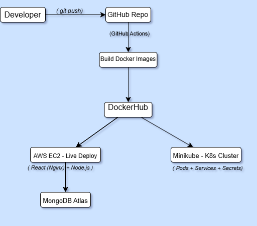
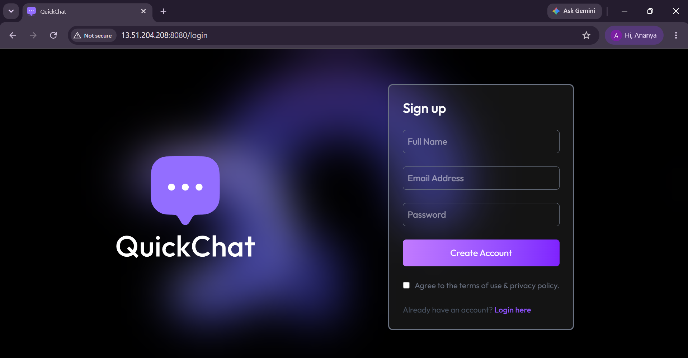
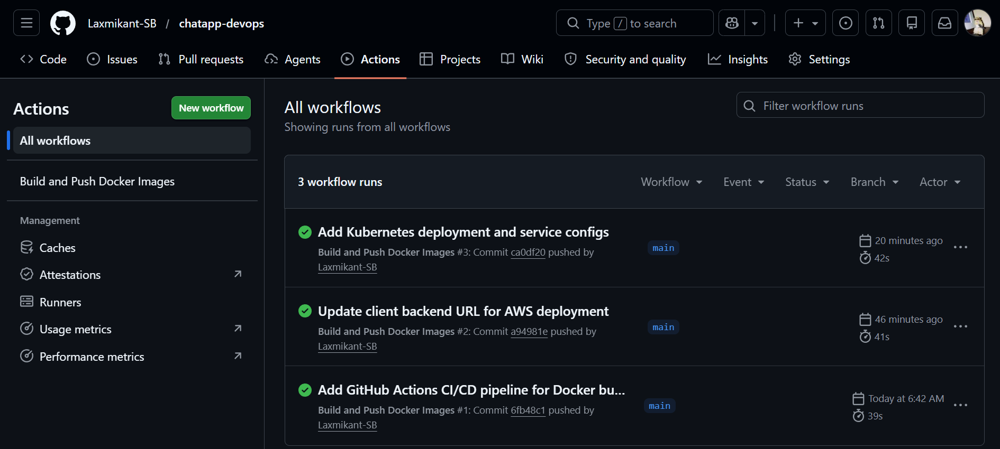

<div align="center">

# 💬 QuickChat
### Real-Time MERN Chat App with a Complete DevOps Pipeline

[](https://www.docker.com/)
[](https://kubernetes.io/)
[](https://aws.amazon.com/)
[](https://github.com/features/actions)
[](https://nginx.org/)
[](https://react.dev/)
[](https://nodejs.org/)
[](https://www.mongodb.com/)

🌐 **[Live Demo →](https://laxmikant-chatapp.duckdns.org)**
        https://laxmikant-chatapp.duckdns.org

</div>

---

## 📌 About This Project

**QuickChat** is a full-stack real-time chat application built with the **MERN stack** and **Socket.io** — but this project is more than just an app. It's an end-to-end demonstration of a **production-style DevOps workflow**:

> Code → Docker → CI/CD → DockerHub → AWS EC2 (Live, HTTPS) + Kubernetes Cluster

Every part of the pipeline below was built, tested, and deployed manually as a learning exercise — from writing Dockerfiles to debugging real cloud deployment issues, including securing the app with a custom domain and SSL.

---

## ✨ App Features

| Feature | Description |
|---|---|
| 🔐 Authentication | Secure JWT-based login & signup with bcrypt password hashing |
| ⚡ Real-Time Chat | Instant messaging powered by Socket.io |
| 🟢 Live Status | Online/offline user presence indicators |
| 🖼️ Media Sharing | Profile pictures & images via Cloudinary |
| 📱 Responsive UI | Built with React + Tailwind CSS |

---

## 🏗️ Architecture & Deployment Pipeline



**Flow:**
1. 👨‍💻 Push code to GitHub
2. ⚙️ **GitHub Actions** automatically builds Docker images for client & server
3. 📦 Images pushed to **DockerHub**
4. ☁️ Images deployed live on **AWS EC2** (Ubuntu + Docker)
5. 🔒 **Nginx reverse proxy** + **Let's Encrypt SSL** secure the app on a custom domain (HTTPS)
6. ☸️ Same images deployable to a **Kubernetes cluster** (Deployments, Services, Secrets)

---

## 📸 Screenshots

<div align="center">

| Login Page | Github Actions |
|:---:|:---:|
|  |  |

</div>

---

## 🛠️ Tech Stack

### Application
- **Frontend:** React, Vite, Tailwind CSS, Socket.io-client, Axios
- **Backend:** Node.js, Express, Socket.io, MongoDB (Mongoose), JWT, Bcrypt
- **Database:** MongoDB Atlas (Cloud)
- **Media Storage:** Cloudinary

### DevOps & Infrastructure
| Tool | Purpose |
|---|---|
| 🐳 **Docker** | Multi-stage builds — React app served via Nginx, Node.js backend |
| 🧩 **Docker Compose** | Local multi-container orchestration |
| ⚙️ **GitHub Actions** | CI/CD — auto build & push images to DockerHub on every commit |
| ☁️ **AWS EC2** | Live cloud deployment (Ubuntu server) |
| 🌐 **Nginx + Let's Encrypt** | Reverse proxy with free auto-renewing SSL for custom domain (HTTPS) |
| 🆓 **DuckDNS** | Free custom subdomain mapped to EC2's public IP |
| ☸️ **Kubernetes (Minikube)** | Container orchestration — Deployments, Services, Secrets |

---

## 🚀 Getting Started (Local Development)

### Prerequisites
- Node.js v18+
- Docker & Docker Compose
- MongoDB Atlas account

### 1. Clone the repository
```bash
git clone https://github.com/Laxmikant-SB/chatapp-devops.git
cd chatapp-devops
```

### 2. Set up environment variables

**`server/.env`**
```env
MONGODB_URI=your_mongodb_connection_string
PORT=5000
JWT_SECRET=your_jwt_secret
CLOUDINARY_CLOUD_NAME=your_cloud_name
CLOUDINARY_API_KEY=your_api_key
CLOUDINARY_API_SECRET=your_api_secret
```

**`client/.env`**
```env
VITE_BACKEND_URL=http://localhost:5000
```

### 3. Run with Docker Compose
```bash
docker-compose up --build
```

Visit **http://localhost:8080** 🎉

---

## ⚙️ CI/CD Pipeline

Every push to `main` triggers [`.github/workflows/docker-build.yml`](.github/workflows/docker-build.yml), which:

1. ✅ Checks out the latest code
2. 🏗️ Builds Docker images for client & server (client built with the production `VITE_BACKEND_URL` pointing to the live HTTPS domain)
3. 📤 Pushes them to DockerHub:
   - [`laxmikant07/chatapp-server`](https://hub.docker.com/r/laxmikant07/chatapp-server)
   - [`laxmikant07/chatapp-client`](https://hub.docker.com/r/laxmikant07/chatapp-client)

---

## ☁️ Cloud Deployment (AWS EC2)

Deployed on an AWS EC2 (Ubuntu) instance — images pulled directly from DockerHub:

```bash
docker run -d -p 5000:5000 --env-file server.env \
  --name chatapp-server --restart unless-stopped \
  laxmikant07/chatapp-server:latest

docker run -d -p 8080:80 \
  --name chatapp-client --restart unless-stopped \
  laxmikant07/chatapp-client:latest
```

---

## 🔒 Custom Domain & HTTPS

The live app is served securely over **HTTPS** using a free **DuckDNS** subdomain and **Let's Encrypt** SSL:

1. A free subdomain (`laxmikant-chatapp.duckdns.org`) points to the EC2 instance's public IP
2. **Nginx** runs on the EC2 host as a reverse proxy in front of the Docker containers:
   - `/` → React frontend container (port 8080)
   - `/api` and `/socket.io` → Node.js backend container (port 5000), with WebSocket upgrade headers for Socket.io
3. **Certbot (Let's Encrypt)** automatically issued and configured a free SSL certificate, with auto-renewal enabled
4. HTTP requests are automatically redirected to HTTPS

This means the chat app is accessible over a real domain with a 🔒 padlock — no IP addresses or insecure ports exposed to end users.

---

## ☸️ Kubernetes Deployment

Manifests available in [`/k8s`](./k8s) for deploying on any Kubernetes cluster (tested with Minikube):

```bash
# Create secret from env file
kubectl create secret generic chatapp-server-secret --from-env-file=server/.env

# Apply deployments & services
kubectl apply -f k8s/server-deployment.yaml
kubectl apply -f k8s/client-deployment.yaml
```

This creates:
- 🚀 **Deployments** — auto-restart on failure for client & server
- 🌐 **NodePort Services** — expose both apps
- 🔒 **Secrets** — secure env variable management

---

## 📁 Project Structure
chatapp-devops/                                                                                   
├── client/                  # React frontend                                                                        
│   ├── Dockerfile                                                                                   
│   ├── nginx.conf                                                                                   
│   └── src/                                                                                   
├── server/                  # Node.js backend                                                                      
│   ├── Dockerfile                                                                                   
│   └── ...                                                                                   
├── k8s/                      # Kubernetes manifests                                                               
│   ├── server-deployment.yaml                                                                                   
│   └── client-deployment.yaml                                                                                   
├── .github/workflows/        # CI/CD pipeline                                                                      
│   └── docker-build.yml                                                                                   
├── docker-compose.yml                                                                                     
└── README.md                                                                                   
---

## 🎯 What This Project Demonstrates

- Writing optimized, multi-stage **Dockerfiles**
- Orchestrating multi-container apps with **Docker Compose**
- Building automated **CI/CD pipelines** with GitHub Actions
- Deploying containerized apps to **AWS EC2**
- Securing a live app with a custom domain, **Nginx reverse proxy**, and **Let's Encrypt SSL (HTTPS)**
- Managing **Kubernetes** Deployments, Services & Secrets
- Debugging real-world issues: DNS resolution, env var handling, SPA routing with Nginx, mixed-content/HTTPS issues, and cloud networking

---

<div align="center">

## 👤 Author

**Laxmikant Babaleshwar**

[](https://github.com/Laxmikant-SB)

⭐ If you found this project helpful, consider giving it a star!

</div>
